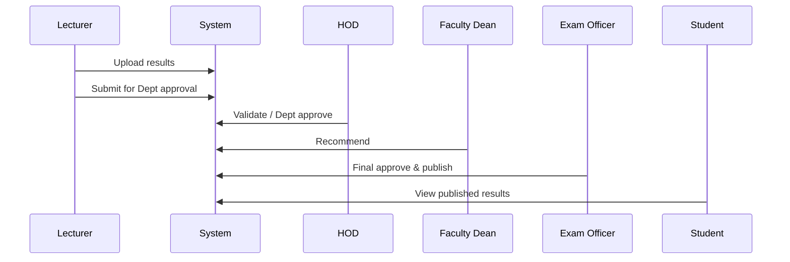

# Diagrams (Mermaid)

## ER Diagram

```mermaid
erDiagram
  FACULTY ||--o{ DEPARTMENT : has
  DEPARTMENT ||--o{ COURSE : offers
  COURSE ||--o{ RESULT : has
  STUDENT ||--o{ RESULT : receives
  USER ||--o{ RESULT : enters (lecturer)
  USER {
    int id
    string email
    enum role
  }
  FACULTY {
    int id
    string name
  }
  DEPARTMENT {
    int id
    string name
  }
  COURSE {
    int id
    string code
    string title
  }
  STUDENT {
    int id
    string student_number
  }
  RESULT {
    int id
    decimal ca_score
    decimal exam_score
    enum status
  }
```

## Use Case (High level)

```mermaid
usecase
  :Lecturer: --> (Upload Results)
  (Upload Results) --> (Submit Results)
  :HOD: --> (Validate Results)
  :Faculty Dean: --> (Recommend Results)
  :Exam Officer: --> (Approve & Publish)
  :Student: --> (View Results)
```

## Sequence: Upload -> Approve -> Publish


